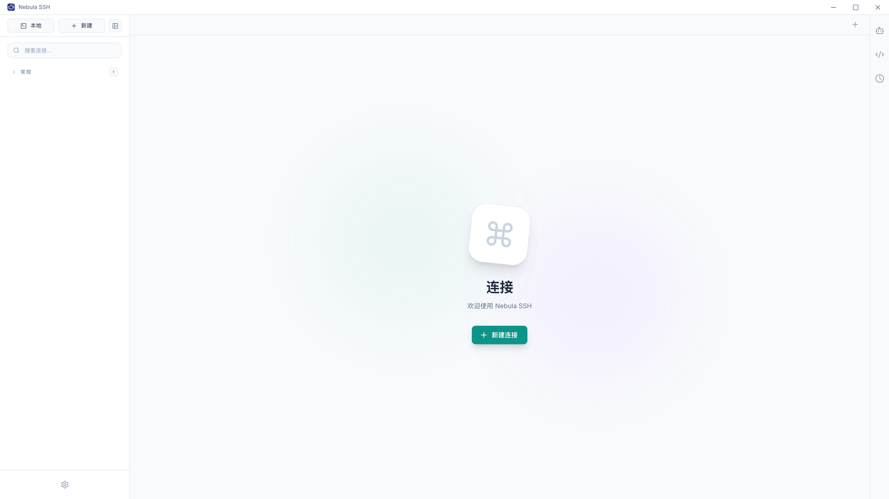
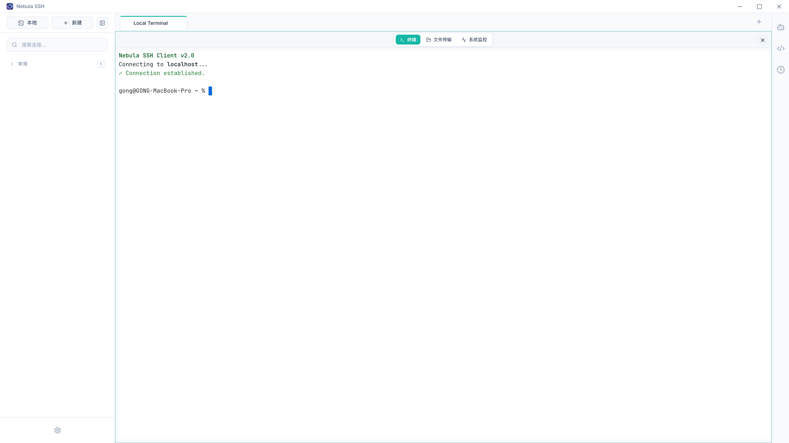
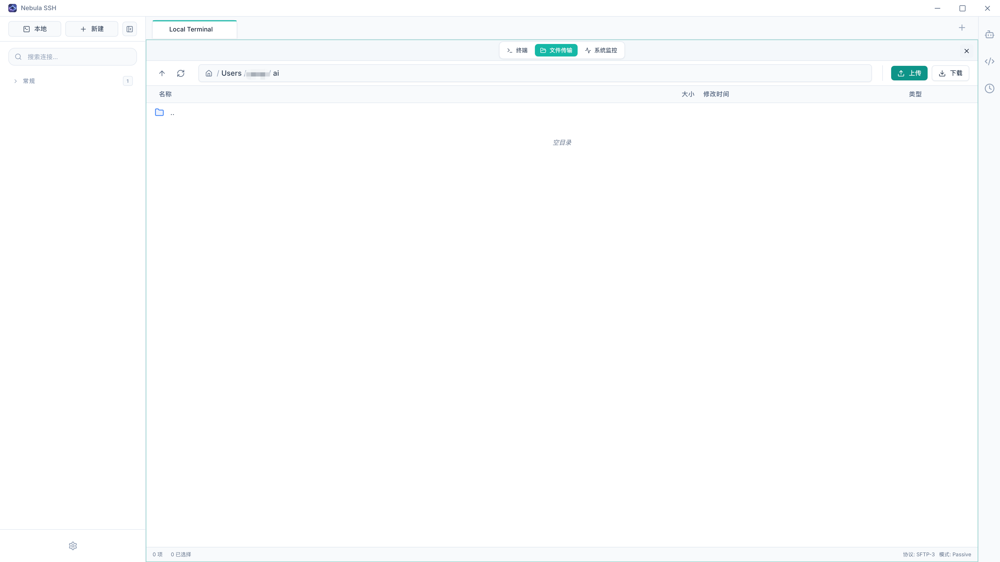
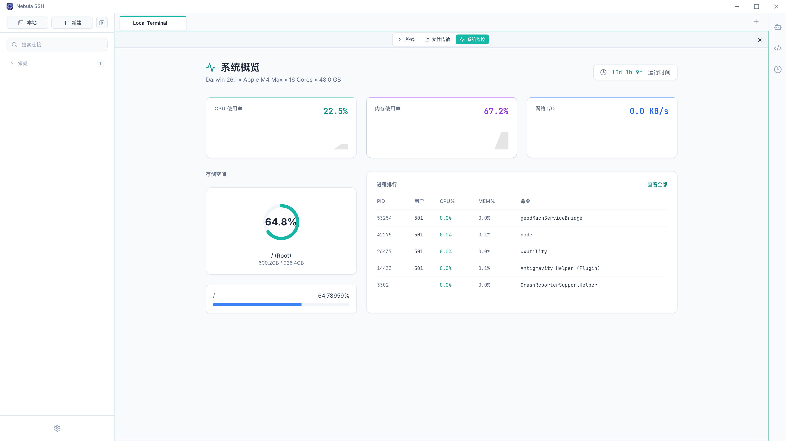
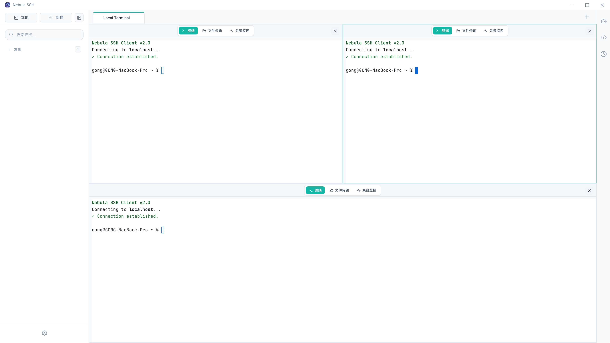

# Nebula SSH

<div align="center">
  
  
  <h1>Nebula SSH</h1>
  
  <p>
    <strong>专为性能和美学打造的下一代 SSH 客户端</strong>
  </p>

  <p>
    <a href="README.md">English Documentation</a> | 
    <a href="https://github.com/G2CH/NebulaSSH/releases">下载</a>
  </p>

  <p>
    
    
    
  </p>
</div>

---

## ✨ 功能特性

### 核心功能
- 🚀 **极致性能**：基于 Rust 和 Tauri 构建，资源占用极低，启动速度飞快
- 🎨 **现代设计**：精美的无边框窗口设计，支持毛玻璃效果和流畅动画
- 💻 **全功能终端**：基于 xterm.js，支持自定义主题、字体和本地终端
- 🔐 **安全为先**：本地加密存储，支持主密码保护和自动锁定

### 安全与隐私
- 🔒 **主密码保护**：设置主密码保护您的敏感连接数据
- ⏱️ **自动锁定**：可配置空闲超时（5/10/15 分钟）或完全禁用
- 🔐 **数据库加密**：使用 AES-256 加密 SQLite 数据库，采用 Argon2 密码哈希
- 🛡️ **会话持久化**：重启后安全恢复所有会话
- 🔄 **自动重连**：网络中断后自动重新连接

### 文件管理
- 📂 **SFTP 集成**：内置文件浏览器，支持拖拽上传下载
- 📝 **远程文件编辑**：直接编辑远程文件，支持语法高亮（Monaco Editor）
- 🗂️ **文件图标**：美观的文件类型图标，更好的视觉体验

### 高级功能
- 🪟 **分屏功能**：支持水平和垂直分屏，多任务并行
- 📊 **系统监控**：实时监控服务器状态（CPU、内存、磁盘、网络、进程）
- 📋 **指令片段**：保存并一键执行常用命令
- 🤖 **AI 助手**：智能命令生成和故障排查，支持上下文感知建议
- 🔗 **端口转发**：支持本地和远程端口转发
- 🌉 **跳板机**：通过堡垒机/跳板机连接
- 🌐 **国际化**：完整支持简体中文和英文

### 终端功能
- 🎨 **自定义主题**：内置 Dracula、Nord、Solarized、GitHub 等主题
- 📝 **命令历史**：跨会话追踪和搜索命令历史
- 🎯 **右键菜单**：支持分屏、AI 辅助、复制粘贴等操作
- ✨ **增强的 UI 组件**：优化的下拉选择框，支持多种尺寸和更好的样式

## 🎬 截图展示

<div align="center">
  
  <p><em>现代化、简洁的分屏界面</em></p>
  
  <p><em>现代化、简洁的分屏界面</em></p>
  
  <p><em>现代化、简洁的分屏界面</em></p>
  
  <p><em>现代化、简洁的分屏界面</em></p>
  
  <p><em>现代化、简洁的分屏界面</em></p>
</div>

## 🛠️ 技术栈

- **前端**: React 18, TypeScript, Tailwind CSS, Lucide React
- **后端**: Rust, Tauri 2.x
- **终端**: xterm.js + FitAddon
- **编辑器**: Monaco Editor（VS Code 编辑器内核）
- **数据库**: SQLite with rusqlite
- **SSH**: ssh2 (Rust)
- **状态管理**: React Context + 自定义 Hooks

## 🚀 快速开始

### 下载预编译版本

从 [Releases](https://github.com/G2CH/NebulaSSH/releases) 页面下载适合您平台的最新版本。

### 从源码编译

#### 环境要求

- Node.js (v18+)
- Rust (最新稳定版)
- Tauri CLI

#### 安装步骤

1. **克隆项目**
   ```bash
   git clone https://github.com/G2CH/NebulaSSH.git
   cd NebulaSSH
   ```

2. **安装依赖**
   ```bash
   npm install
   ```

3. **启动开发模式**
   ```bash
   npm run tauri dev
   ```

4. **构建生产版本**
   ```bash
   npm run tauri build
   ```

## 📖 使用指南

### 连接服务器

1. 点击侧边栏的"新建连接"按钮
2. 输入服务器信息（主机、端口、用户名、密码/密钥）
3. 点击"连接"建立 SSH 会话

### 使用分屏

- 在终端右键选择"垂直分屏"或"水平分屏"
- 每个窗格保持独立的 SSH 会话
- 当存在多个窗格时，使用右上角的 X 按钮关闭窗格

### 文件管理

1. 点击终端视图中的"文件"标签
2. 浏览远程文件、创建文件夹、上传下载文件
3. 双击文件可在内置编辑器中编辑

### AI 助手

1. 在终端中选择文本
2. 右键选择"询问 AI"、"解释"或"修复"
3. AI 对话框将打开并提供上下文感知的建议

## 🔧 配置说明

### AI 助手设置

在设置中配置您的 AI 提供商：

1. 点击侧边栏的设置图标
2. 导航到 AI 设置
3. 输入您的 API 密钥和端点
4. 支持的提供商：OpenAI、Azure OpenAI 或任何兼容 OpenAI 的 API

### 安全设置

通过以下安全功能保护您的敏感连接数据：

#### 主密码
1. 首次启动时，您将被提示设置主密码
2. 此密码用于加密数据库和解锁应用程序
3. 请使用强且易记的密码 - 如果忘记密码将无法恢复

#### 自动锁定配置
1. 打开 设置 → 安全
2. 开启/关闭自动锁定
3. 启用时，可选择：
   - **5 分钟**：空闲 5 分钟后锁定
   - **10 分钟**：空闲 10 分钟后锁定（默认）
   - **15 分钟**：空闲 15 分钟后锁定
4. 禁用时，应用永远不会自动锁定（启动时仍需要主密码）

#### 数据库加密
- 所有连接数据使用 AES-256 加密
- 密码使用 Argon2 哈希，确保最大安全性
- 加密密钥由您的主密码派生

### 终端主题

从内置主题中选择或自定义您的主题：
- 默认深色
- Dracula
- Nord
- Solarized 深色/浅色
- GitHub 深色/浅色
- One Dark

## ❓ 常见问题

### macOS: "应用已损坏，无法打开"

这是 macOS 的安全机制（Gatekeeper）拦截了未签名的应用：

1. 打开终端
2. 运行以下命令：
   ```bash
   sudo xattr -r -d com.apple.quarantine /Applications/NebulaSSH.app
   ```
   *（请将 `/Applications/NebulaSSH.app` 替换为您实际的应用路径）*

### Linux: 缺少依赖

在某些 Linux 发行版上，您可能需要安装额外的依赖：

```bash
# Debian/Ubuntu
sudo apt install libwebkit2gtk-4.1-dev libgtk-3-dev libayatana-appindicator3-dev

# Fedora
sudo dnf install webkit2gtk4.1-devel gtk3-devel libappindicator-gtk3-devel

# Arch
sudo pacman -S webkit2gtk-4.1 gtk3 libappindicator-gtk3
```

## 🗺️ 开发路线图

> **产品定位**：NebulaSSH 是专业的单机离线 SSH 客户端，专为企业内网环境设计，注重性能、安全和效率。

### ✅ v0.3.0 - 会话管理与安全（已完成）
**核心重点**：关键的用户体验和安全性改进

- [x] **会话持久化** - 重启后恢复所有会话
- [x] **自动重连** - 断线后自动重新连接
- [x] **主密码保护** - 启动时使用主密码解锁
- [x] **自动锁定** - 可配置空闲超时（5/10/15 分钟，或禁用）
- [x] **本地数据加密** - 加密 SQLite 数据库中的敏感数据
- [x] **AI Markdown 渲染** - 修复 AI 响应渲染，使用 github-markdown-css
- [x] **优化 Select 组件** - 增强下拉菜单 UI，支持尺寸变体
- [x] **上下文菜单增强** - ANSI 代码清理，提供干净的 AI 上下文

### v0.4.0 - 批量操作 🔥
**核心重点**：运维团队的批量服务器管理

- [ ] **配置备份/恢复** - 导出/导入加密的 JSON 配置
- [ ] **SSH Agent 转发** - 转发 SSH agent 到跳板机
- [ ] **URL 点击支持** - Cmd/Ctrl+点击在浏览器中打开
- [ ] **广播输入** - 同时向多台服务器发送命令
- [ ] **批量脚本执行** - 一次在多台机器上执行脚本
- [ ] **结果聚合** - 收集和对比多台服务器的输出
- [ ] **服务器分组** - 增强的树形结构组织
- [ ] **颜色标记** - 使用颜色进行视觉组织

### v0.5.0 - 用户体验
**核心重点**：打磨细节，改善日常工作流

- [ ] **自定义快捷键** - 完全可配置的快捷键
- [ ] **工作区** - 保存和恢复窗口布局和会话集
- [ ] **标签管理** - 拖拽、分组、颜色标记
- [ ] **全局搜索** - 快速搜索服务器和命令历史
- [ ] **预设快捷键方案** - VS Code、Vim 风格的快捷键

### v0.6.0 - AI 深度集成🚀
**核心重点**：AI 原生功能，建立竞争差异化

- [ ] **AI 命令补全** - 输入时实时建议
- [ ] **自然语言转命令** - "找出最大的文件" → 自动执行
- [ ] **智能错误恢复** - 自动建议修复失败的命令
- [ ] **本地 AI 模型支持** - Ollama 集成，完全离线使用
- [ ] **AI 工作流生成器** - 将复杂操作录制为脚本

### v1.0 - 生产就绪
**核心重点**：稳定性、性能和生态系统

- [ ] **性能优化** - 更快的启动速度，更低的内存占用
- [ ] **稳定性** - 全面的错误处理和崩溃恢复
- [ ] **文档完善** - 完整的用户手册和教程
- [ ] **插件系统** - 允许社区主题和扩展
- [ ] **审计日志** - 企业级操作日志记录

## 🤝 贡献指南

欢迎贡献！请随时提交 Pull Request。

## 📄 开源协议

本项目采用 MIT 协议 - 详情请参阅 [LICENSE](LICENSE) 文件。

## 🙏 致谢

- [Tauri](https://tauri.app/) - 桌面应用开发框架
- [xterm.js](https://xtermjs.org/) - 终端模拟器
- [ssh2](https://github.com/alexcrichton/ssh2-rs) - Rust SSH 实现
- [Lucide](https://lucide.dev/) - 美观的图标库

---

<div align="center">
  <p>用 ❤️ 制作 by <a href="https://github.com/G2CH">G2CH</a></p>
  <p>⭐ 如果这个项目对您有帮助，请在 GitHub 上给我们一个星标！</p>
</div>
